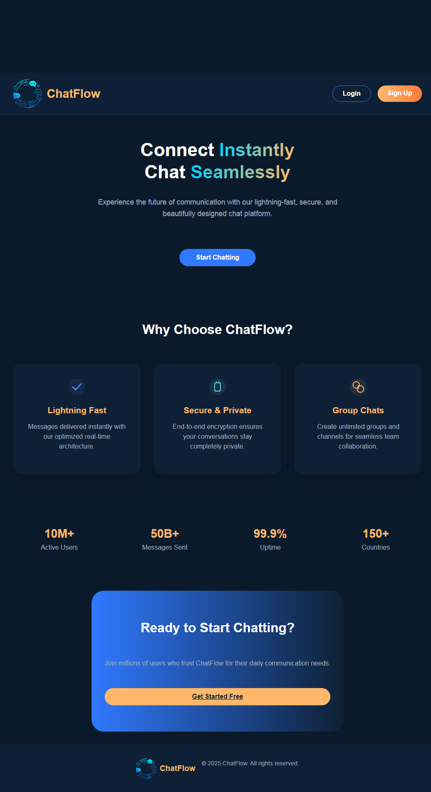
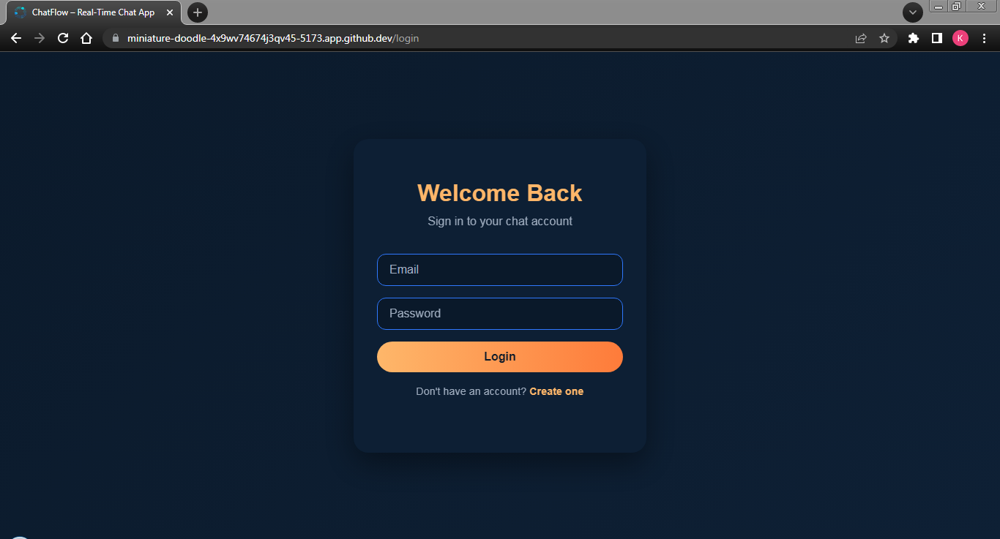
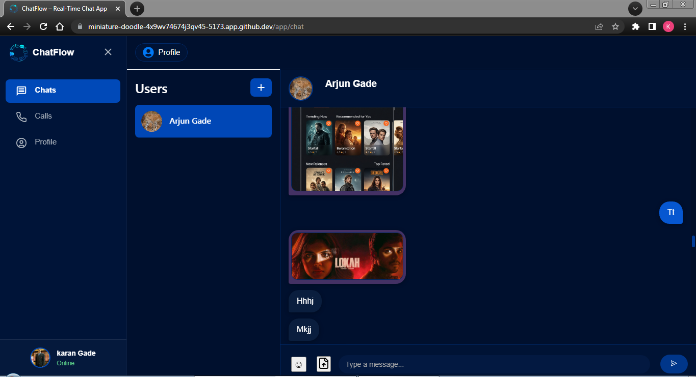
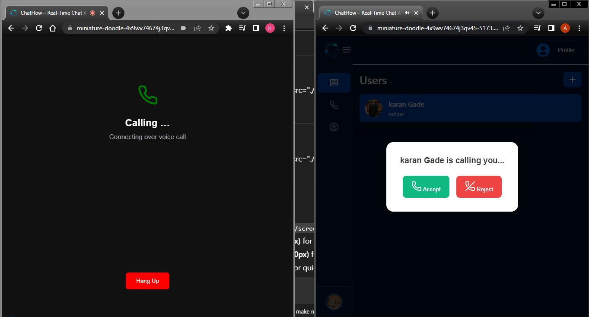

# ChatFlow

A modern, full-stack real-time chat application with secure authentication, file sharing, and video/voice calling.

---

## Table of Contents

- Motivation
- Tech Stack
- Features
- Screenshots
- Project Structure
- Setup & Installation
- Usage

---

## Motivation

ChatFlow was created to provide a seamless, secure, and feature-rich communication platform for individuals and teams. It solves the need for instant messaging, file sharing, and video/voice calls in a single, easy-to-use web application.

---

## Tech Stack

**Frontend:**

- React (with Vite)
- React Router
- Context API
- Socket.io-client
- WebRTC

**Backend:**

- Node.js
- Express.js
- Socket.io
- MongoDB (Mongoose)
- Cloudinary (file storage)
- Multer (file uploads)
- JWT (authentication)
- Nodemailer (email/OTP)

---

## Features

- Real-time 1:1 chat with friends
- Secure JWT authentication with email OTP verification
- Online/offline status and last seen
- File, image, and media sharing (Cloudinary integration)
- Video and voice calling (WebRTC + Socket.io signaling)
- Responsive design for desktop and mobile
- User profile management
- Add/remove friends
- Modern, clean UI

---

## Screenshots

> Perfect 🚀 You’ve got 4 key pages (Landing, Login, Chat, Call). I’ll give you a **stylish screenshot section** that you can drop right into your `README.md`.

---

## 📸 Screenshots

### 🏠 Landing Page

<p align="center">  
    
</p>

---

### 🔐 Login Page

<p align="center">  
    
</p>

---

### 💬 Chat Interface

<p align="center">  
    
</p>

---

### 📞 Call Screen

<p align="center">  
    
</p>  
---

## Project Structure

```
chat_application/
│
├── backend/
│   ├── authentication/         # Auth middleware
│   ├── config/                 # DB, Cloudinary, Multer, Socket.io config
│   ├── controller/             # Route controllers (auth, chat, friends, etc.)
│   ├── handler/                # File upload handlers
│   ├── model/                  # Mongoose models (User, Messages)
│   ├── public/                 # Static files (frontend build)
│   ├── router/                 # Express routers
│   ├── index.js                # Main server entry point
│   └── package.json
│
├── frontend/
│   ├── public/                 # Static assets
│   ├── src/
│   │   ├── assets/             # Images, audio, etc.
│   │   ├── components/         # Reusable UI components
│   │   ├── hooks/              # Custom React hooks
│   │   ├── pages/              # App pages (Chat, Login, Signup, etc.)
│   │   ├── routers/            # React Router setup
│   │   ├── store/              # Context providers
│   │   ├── App.jsx             # Main app component
│   │   └── main.jsx            # Entry point
│   ├── package.json
│   └── vite.config.js
│
├── README.md
└── .env.example
```

---

## Setup & Installation

### Prerequisites

- Node.js (v18+ recommended)
- npm
- MongoDB instance (local or cloud)
- Cloudinary account (for file uploads)

### 1. Clone the repository

```bash
git clone https://github.com/KaranGade24/chat_application.git
cd chat_application
```

### 2. Backend Setup

```bash
cd backend
cp .env.example .env   # Fill in your environment variables
npm install
npm run dev            # Starts backend on http://localhost:8080
```

### 3. Frontend Setup

```bash
cd ../frontend
cp .env.example .env   # Set VITE_API_URL to your backend URL
npm install
npm run dev            # Starts frontend on http://localhost:5173
```

---

## Usage

1. Register with your email (OTP verification required).
2. Log in and add friends by email.
3. Start chatting, share files, or initiate a voice or video call.
4. Manage your profile and friend list.

---
